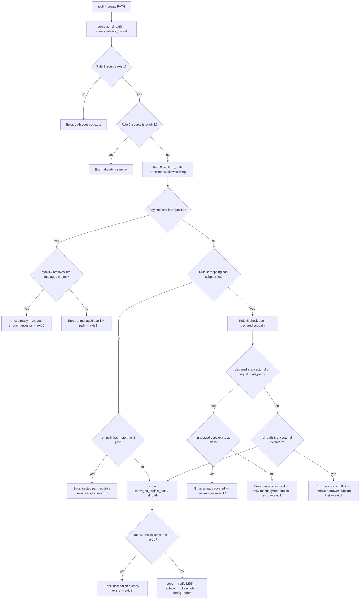

# Design Document: Fix `revlink create/restore` Path Handling

## Overview

`revlink create` currently derives the managed destination path using `source.name` (the
basename), which is wrong for any path that is not a direct child of CWD. The fix replaces
all uses of `source.name` with `rel_path` — the full relative path from CWD to source — so
the managed layout mirrors the target layout exactly, consistent with how `link sync` handles
subpath entries.

`revlink restore` has the same bug and receives the same fix.

In addition, `CreateOperation._validate` gains four new rules (Rules 3–5) that guard against
intermediate symlinks, sync-all/nested-path conflicts, and selective-sync subpath conflicts.

### Key Design Constraints

- `rel_path` is computed in `cli.py` before constructing the operation and passed as a new
  required field. The operation itself does not call `Path.cwd()`.
- Rules 3, 4, and 5 require `self.context` (for `cwd` and `matched_mapping`). When
  `self.context is None` these rules are skipped — tests that pass no context are not
  exercising config-aware validation.
- `RestoreOperation` does **not** gain Rules 3–5. The source is already a symlink (Rule 2
  catches non-symlinks) and the managed-copy-exists check already confirms the path is
  managed.

---

## Definitions

| Term | Meaning |
|---|---|
| `cwd` | Current working directory (absolute) |
| `source` | Absolute path of the argument (`Path(path).resolve()`) |
| `rel_path` | `source.relative_to(cwd)` — e.g. `.kiro/specs/revlink-subcommands` |
| `managed_project_path` | Managed project root resolved from config |
| `matched_mapping` | The `Mapping` whose `targets` list contains `cwd` |
| `dest` | `managed_project_path / rel_path` — the correct managed destination |

---

## Root Cause

```python
# Current (wrong for nested paths)
dest = dest_root / source.name   # source.name = "revlink-subcommands" (basename only)

# Fixed
dest = dest_root / rel_path      # rel_path = ".kiro/specs/revlink-subcommands"
```

Given `CWD = /target` and `source = /target/.kiro/specs/revlink-subcommands`:

| | Current | Fixed |
|---|---|---|
| Managed copy | `managed/revlink-subcommands` | `managed/.kiro/specs/revlink-subcommands` |
| Symlink | `target/.kiro/specs/revlink-subcommands → managed/revlink-subcommands` | `target/.kiro/specs/revlink-subcommands → managed/.kiro/specs/revlink-subcommands` |

The fixed layout is exactly what `link sync` would create given
`subpath: [.kiro/specs/revlink-subcommands]`.

---

## How `link sync` Resolves Paths (Baseline)

`_load_items` in `model/translator.py` creates `ManagedProjectItem` with:

```python
ManagedProjectItem(
    name=subpath,          # e.g. ".kiro/specs/revlink-subcommands"
    path=managed / subpath,
    strategy=SYMLINK,
)
```

`SymlinkManager.create_links` then creates:

```python
link_path = target_path / item.name   # target/.kiro/specs/revlink-subcommands
link_path.parent.mkdir(parents=True, exist_ok=True)
link_path.symlink_to(item.path)       # → managed/.kiro/specs/revlink-subcommands
```

`revlink create` must mirror this exactly.

---

## Validation Rules (CreateOperation)

Rules are checked in order. Each rule is self-contained.

### Rule 1 — Source must exist

`source.exists()` must be true.

> `Error: Path does not exist: {source}` → exit 1

### Rule 2 — Source must not be a symlink

`source.is_symlink()` must be false.

> `Error: Path is already a symlink: {source}` → exit 1

### Rule 3 — No intermediate symlink in the path

Walk ancestors of `rel_path` from shallowest to deepest, excluding `Path('.')`.
For `rel_path = .kiro/specs/revlink-subcommands` the ancestors are `.kiro`, then `.kiro/specs`.

For each ancestor `anc`, compute `candidate = cwd / anc`. If `candidate.is_symlink()`:

- `resolved = candidate.resolve()`
- If `resolved.is_relative_to(managed_project_path)`:
  - Already managed through this ancestor. Print info and **exit 0**:
    > `'{anc}' is a managed symlink — '{rel_path}' is already managed through it. Nothing to do.`
- Else:
  - Unmanaged symlink in path. **Exit 1**:
    > `Error: '{anc}' is a symlink not managed by blf. Cannot adopt a path through an unmanaged symlink.`

Skipped when `self.context is None`.

### Rule 4 — Sync-all mapping: only top-level paths allowed

Applies **only when** `matched_mapping.subpaths is None`.

If `len(rel_path.parts) > 1`:

> `Error: '{rel_path}' is a nested path. This mapping uses sync-all — only top-level paths can be adopted directly. Add a 'subpath' entry to your config mapping first.` → exit 1

If `len(rel_path.parts) == 1`, proceed normally — no subpath entry will be added to config.

Skipped when `self.context is None`.

### Rule 5 — Selective sync mapping: no ancestor subpath conflict

Applies **only when** `matched_mapping.subpaths is not None`.

For each `declared` in `matched_mapping.subpaths` (as `declared_path = Path(declared)`):

**5a — declared is ancestor of (or equal to) `rel_path`:**

Condition: `rel_path == declared_path or rel_path.is_relative_to(declared_path)`

Compute `managed_copy = managed_project_path / rel_path`.

- If `managed_copy.exists()`:
  > `Error: '{declared}' is already a declared subpath that covers this path, and the managed copy already exists at '{managed_copy}'. Run 'blf link sync' to create the symlink.` → exit 1
- If not `managed_copy.exists()`:
  > `Error: '{declared}' is already a declared subpath that covers this path. Copy '{source}' to '{managed_copy}' manually, then run 'blf link sync' to create the symlink.` → exit 1

**5b — `rel_path` is ancestor of a declared subpath (reverse conflict):**

Condition: `declared_path.is_relative_to(rel_path)` and `declared_path != rel_path`

> `Error: '{declared}' is a declared subpath under this path. Adopting '{rel_path}' would conflict with it. Remove '{declared}' from the config subpath list first, or adopt a more specific path.` → exit 1

Skipped when `self.context is None`.

### Rule 6 — Destination must not already exist (unless --force)

`dest = managed_project_path / rel_path`

If `dest.exists()` and `--force` is not set:

> `Error: Destination already exists: {dest}\nUse --force to overwrite.` → exit 1

---

## Validation Flow



---

## Architecture

This fix is a targeted refactor within the existing `revlink` standalone execution path.
No new modules, classes, or abstractions are introduced.

```
cli.py
  └── revlink_create / revlink_restore
        └── operations/revlink.py
              ├── CreateOperation   ← add rel_path field; update dest derivation; add Rules 3–5
              └── RestoreOperation  ← add rel_path field; update managed path derivation
```

The change is purely internal to `CreateOperation` and `RestoreOperation`. The CLI layer
gains one line each (`rel_path = source.relative_to(cwd)` and `rel_path = Path(path)`) and
passes the value as a new constructor field.

---

## Components and Interfaces

### `CreateOperation` (modified)

New field added to the existing `@dataclass`:

```python
rel_path: Path   # source.relative_to(cwd) — preserves directory structure
```

All internal uses of `self.source.name` are replaced:

| Location | Old | New |
|---|---|---|
| `run()` dest derivation | `dest_root / source.name` | `dest_root / rel_path` |
| `_preview()` dest derivation | `dest_root / source.name` | `dest_root / rel_path` |
| `_preview()` config update | `source.name` | `str(rel_path)` |
| `_git_exclude()` entry name | `source.name` | `str(rel_path)` |
| `_git_exclude_preview()` entry name | `source.name` | `str(rel_path)` |
| `_update_config()` entry name | `source.name` | `str(rel_path)` |

New validation logic added to `_validate()` between Rule 2 (symlink check) and Rule 6
(dest-exists check): Rules 3, 4, and 5 as defined in the Validation Rules section above.

### `RestoreOperation` (modified)

New field added to the existing `@dataclass`:

```python
rel_path: Path   # Path(path) — already relative, no resolve() needed
```

All internal uses of `self.source.name` are replaced:

| Location | Old | New |
|---|---|---|
| `run()` managed path derivation | `dest_root / source.name` | `dest_root / rel_path` |
| `_git_exclude()` entry name | `source.name` | `str(rel_path)` |
| `_remove_config()` entry name | `source.name` | `str(rel_path)` |

### `cli.py` — `revlink_create` (modified)

One new line added after `source = Path(path).resolve()`:

```python
rel_path = source.relative_to(cwd)
```

`rel_path=rel_path` passed to `CreateOperation(...)`.

### `cli.py` — `revlink_restore` (modified)

One new line added after `source = (cwd / path).absolute()`:

```python
rel_path = Path(path)
```

`rel_path=rel_path` passed to `RestoreOperation(...)`.

---

## Data Models

No new persistent data models are introduced. The fix operates entirely on the existing
`CreateOperation` and `RestoreOperation` dataclasses.

The `rel_path: Path` field is transient operation state — it is computed in `cli.py` and
passed to the operation constructor. It is not persisted anywhere.

---

## Required Code Changes

### `CreateOperation` — add `rel_path` field

```python
@dataclass
class CreateOperation:
    source: Path          # absolute path to the source in CWD
    dest_root: Path       # managed_project_path
    rel_path: Path        # source.relative_to(cwd) — preserves directory structure
    dry_run: bool
    force: bool
    formatter: CreateFormatter
    context: RevlinkContext | None = field(default=None)
```

**`run()`** — dest derivation changes from `dest_root / source.name` to `dest_root / rel_path`.

**`_validate(dest)`** — insert Rules 3, 4, and 5 between the existing symlink check (Rule 2)
and the dest-exists check (Rule 6). Uses `self.context.cwd` and
`self.context.matched_mapping.subpaths`.

**`_git_exclude()` and `_update_config()`** — use `str(self.rel_path)` as the entry name
instead of `self.source.name`.

**`_preview()`** — use `self.dest_root / self.rel_path` as dest.

### `RestoreOperation` — add `rel_path` field

```python
@dataclass
class RestoreOperation:
    source: Path
    dest_root: Path
    rel_path: Path        # Path(path) — already relative, no resolve() needed
    dry_run: bool
    formatter: RestoreFormatter
    context: RevlinkContext | None = field(default=None)
```

**`run()`** — managed path changes from `dest_root / source.name` to `dest_root / rel_path`.

**`_git_exclude()` and `_remove_config()`** — use `str(self.rel_path)` as the entry name.

### `cli.py` — `revlink_create`

```python
source = Path(path).resolve()
rel_path = source.relative_to(cwd)   # new

exit_code = CreateOperation(
    source=source,
    dest_root=project.managed_project_path,
    rel_path=rel_path,               # new field
    dry_run=dry_run,
    force=force,
    formatter=CreateFormatter(dry_run=dry_run),
    context=ctx_obj,
).run()
```

### `cli.py` — `revlink_restore`

```python
source = (cwd / path).absolute()
rel_path = Path(path)                # already relative — no resolve() needed

exit_code = RestoreOperation(
    source=source,
    dest_root=project.managed_project_path,
    rel_path=rel_path,               # new field
    dry_run=dry_run,
    formatter=RestoreFormatter(dry_run=dry_run),
    context=ctx_obj,
).run()
```

---

## Error Message Reference

| Rule | Condition | Message | Exit |
|---|---|---|---|
| 1 | Source does not exist | `Error: Path does not exist: {source}` | 1 |
| 2 | Source is a symlink | `Error: Path is already a symlink: {source}` | 1 |
| 3 (managed) | Ancestor symlink → managed project | `'{anc}' is a managed symlink — '{rel_path}' is already managed through it. Nothing to do.` | 0 |
| 3 (foreign) | Ancestor symlink → elsewhere | `Error: '{anc}' is a symlink not managed by blf. Cannot adopt a path through an unmanaged symlink.` | 1 |
| 4 | Sync-all + nested rel_path | `Error: '{rel_path}' is a nested path. This mapping uses sync-all — only top-level paths can be adopted directly. Add a 'subpath' entry to your config mapping first.` | 1 |
| 5a (copy exists) | Declared ancestor, managed copy present | `Error: '{declared}' is already a declared subpath that covers this path, and the managed copy already exists at '{managed_copy}'. Run 'blf link sync' to create the symlink.` | 1 |
| 5a (copy missing) | Declared ancestor, managed copy absent | `Error: '{declared}' is already a declared subpath that covers this path. Copy '{source}' to '{managed_copy}' manually, then run 'blf link sync' to create the symlink.` | 1 |
| 5b (reverse) | rel_path is ancestor of declared | `Error: '{declared}' is a declared subpath under this path. Adopting '{rel_path}' would conflict with it. Remove '{declared}' from the config subpath list first, or adopt a more specific path.` | 1 |
| 6 | Dest exists, no --force | `Error: Destination already exists: {dest}\nUse --force to overwrite.` | 1 |

---

## Correctness Properties

### Property 1: Nested path uses full rel_path as dest suffix

*For any* `CreateOperation` with a `rel_path` of more than one component, `run()` SHALL
derive `dest` as `dest_root / rel_path`, not `dest_root / rel_path.name`.

**Validates: Requirements 1.2, 1.3, 1.4**

### Property 2: Dry-run with nested rel_path never modifies the filesystem

*For any* valid source path (file or directory) with a nested `rel_path`, invoking
`CreateOperation` with `dry_run=True` SHALL leave the filesystem in exactly the same state
as before the invocation.

**Validates: Requirements 3.1, 3.2**

### Property 3: git exclude and config entry use str(rel_path), not source.name

*For any* `CreateOperation` with a nested `rel_path`, the entry written to
`.git/info/exclude` and the config subpath list SHALL be `str(rel_path)`, not
`source.name`.

**Validates: Requirements 4.1, 4.2**

---

## Error Handling

All errors follow the same pattern as the existing `revlink` implementation: print a
descriptive message via `formatter.error()` and return exit code 1. No exceptions propagate
to the user.

The full error message reference is in the Error Message Reference table above. The three
new rules add these additional conditions:

| Rule | Condition | Exit |
|---|---|---|
| 3 (managed) | Ancestor symlink resolves into managed project | 0 (info, not error) |
| 3 (foreign) | Ancestor symlink resolves outside managed project | 1 |
| 4 | Sync-all mapping + nested rel_path | 1 |
| 5a (copy exists) | Declared ancestor subpath, managed copy present | 1 |
| 5a (copy missing) | Declared ancestor subpath, managed copy absent | 1 |
| 5b (reverse) | rel_path is ancestor of declared subpath | 1 |

Rule 3 (managed) is the only case that exits 0 with a non-error message — it is an
informational early exit, not a failure.

---

## Testing Strategy

### Unit tests — `CreateOperation._validate` (new rules)

One test per rule condition:

- Rule 3 (managed): ancestor symlink resolves into managed project → exit 0 with info message
- Rule 3 (foreign): ancestor symlink resolves outside managed project → exit 1
- Rule 4: sync-all mapping + nested rel_path → exit 1
- Rule 5a (copy exists): declared ancestor subpath, managed copy present → exit 1
- Rule 5a (copy missing): declared ancestor subpath, managed copy absent → exit 1
- Rule 5b: rel_path is ancestor of declared subpath → exit 1

### Unit tests — dest path correctness

- `CreateOperation.run` with nested `rel_path` → `dest = dest_root / rel_path` (not basename)
- `CreateOperation._git_exclude` → entry name is `str(rel_path)`, not `source.name`
- `CreateOperation._update_config` → entry name is `str(rel_path)`, not `source.name`

### Updates to existing tests

All existing tests that construct `CreateOperation` or `RestoreOperation` must pass the new
`rel_path` field. For tests where `source` is a direct child of the dest root (i.e.
`rel_path = Path(source.name)`), the behaviour is unchanged — only the field is new.

### Integration tests

- `revlink create .kiro/specs/foo` with selective sync mapping → managed copy at
  `managed/.kiro/specs/foo`, symlink at `target/.kiro/specs/foo`
- `revlink restore .kiro/specs/foo` → managed copy at `managed/.kiro/specs/foo` deleted,
  real file restored at `target/.kiro/specs/foo`
