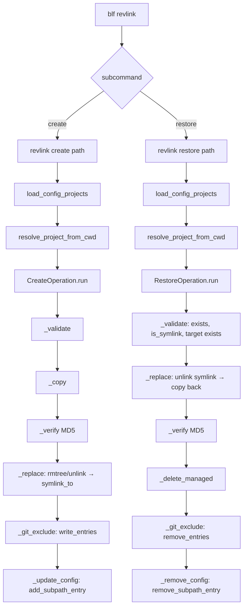
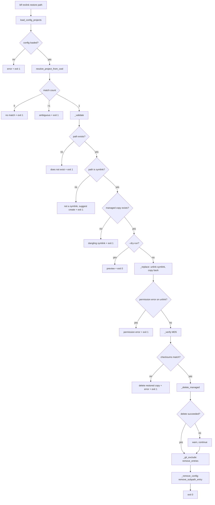

# Design Document: `revlink` Subcommands (`create` / `restore`)

## Overview

This spec evolves the existing `blf revlink <path>` flat command into a subcommand group with two operations:

- `blf revlink create <path>` — identical to the current `revlink` behavior, renamed.
- `blf revlink restore <path>` — the exact inverse: dissolves a managed symlink and recovers the real file from the managed location.

The change also renames the internal classes `RevlinkOperation` → `CreateOperation` and `RevlinkFormatter` → `CreateFormatter` to reflect that the original operation is now one of two subcommands.

### Key Design Constraints

- `revlink` becomes a Click `@group`; `create` and `restore` are registered as subcommands of that group.
- `revlink create` is a pure rename — no behavioral change.
- `revlink restore` is the exact inverse of `revlink create`, undoing every side effect in reverse order.
- Both subcommands support `--dry-run`. Only `create` retains `--force`.
- `RestoreOperation` reuses `RevlinkContext` for the config removal step — no rename needed for that dataclass.
- `ConfigUpdater` gains a new `remove_subpath_entry()` method mirroring `add_subpath_entry()`.
- `GitExcludeManager.remove_entries()` already exists and is reused as-is.
- `RestoreOperation._replace()` MUST use `source.unlink()` to remove the symlink — never `shutil.rmtree`, which would follow the link and delete the managed copy.

---

## Architecture



### `revlink restore` Detailed Flow



---

## Components and Interfaces

### `CreateOperation` (rename of `RevlinkOperation`, in `operations/revlink.py`)

No behavioral change. Rename only.

```python
@dataclass
class CreateOperation:
    source: Path
    dest_root: Path
    dry_run: bool
    force: bool
    formatter: CreateFormatter
    context: RevlinkContext | None = field(default=None)

    def run(self) -> int: ...
```

### `CreateFormatter` (rename of `RevlinkFormatter`, in `operations/revlink.py`)

No behavioral change. Rename only.

```python
class CreateFormatter:
    def __init__(self, dry_run: bool) -> None: ...
    def computing_checksum(self, source: Path) -> None: ...
    def copying(self, source: Path, dest: Path) -> None: ...
    def checksum_ok(self) -> None: ...
    def symlink_created(self, link: Path, target: Path) -> None: ...
    def git_exclude_added(self, name: str) -> None: ...
    def git_exclude_exists(self, name: str) -> None: ...
    def force_warning(self, dest: Path) -> None: ...
    def error(self, message: str) -> None: ...
    def config_updated(self, entry_name: str) -> None: ...
```

### `RestoreFormatter` (new, in `operations/revlink.py`)

Mirrors `CreateFormatter`. Reuses `computing_checksum`, `checksum_ok`, and `error` (same signatures). Adds restore-specific messages.

```python
class RestoreFormatter:
    def __init__(self, dry_run: bool) -> None: ...

    # Reused from CreateFormatter pattern
    def computing_checksum(self, source: Path) -> None: ...
    def checksum_ok(self) -> None: ...
    def error(self, message: str) -> None: ...

    # Restore-specific
    def removing_symlink(self, path: Path) -> None: ...
    # "Removing symlink at {path}"

    def copying_back(self, source: Path, dest: Path) -> None: ...
    # "Copying {source} -> {dest}"

    def managed_copy_deleted(self, path: Path) -> None: ...
    # "✓ Managed copy deleted: {path}"

    def managed_copy_delete_failed(self, path: Path) -> None: ...
    # "Warning: could not delete managed copy at {path}"

    def git_exclude_removed(self, name: str) -> None: ...
    # "Removed {name!r} from .git/info/exclude"

    def git_exclude_not_found(self, name: str) -> None: ...
    # "{name!r} not in .git/info/exclude"

    def config_entry_removed(self, name: str) -> None: ...
    # "Removed {name!r} from config subpath list"
```

### `RestoreOperation` (new, in `operations/revlink.py`)

Exact inverse of `CreateOperation`. `managed` is derived as `dest_root / source.name`, same pattern.

```python
@dataclass
class RestoreOperation:
    source: Path          # CWD path (currently a symlink)
    dest_root: Path       # managed_project_path
    dry_run: bool
    formatter: RestoreFormatter
    context: RevlinkContext | None = field(default=None)

    def run(self) -> int: ...
    def _validate(self, managed: Path) -> int: ...
    def _replace(self, managed: Path) -> int: ...
    def _verify(self, managed: Path) -> int: ...
    def _delete_managed(self, managed: Path) -> None: ...
    def _git_exclude(self) -> int: ...
    def _remove_config(self) -> None: ...
    def _preview(self, managed: Path) -> None: ...
```

**`_replace` implementation note:** The symlink is always a single inode regardless of whether its target is a file or directory. Always use `source.unlink()` — never `shutil.rmtree(source)`. After unlinking, copy the managed content back using `shutil.copy2` (file) or `shutil.copytree` (directory).

**`_delete_managed` implementation note:** After a successful MD5-verified restore, delete the managed copy. Failure (e.g. permission error) is a warning, not fatal — the restore to CWD has already succeeded and been verified.

```python
def _delete_managed(self, managed: Path) -> None:
    try:
        if managed.is_dir():
            shutil.rmtree(managed)
        else:
            managed.unlink()
        self.formatter.managed_copy_deleted(managed)
    except OSError:
        self.formatter.managed_copy_delete_failed(managed)
```

### `ConfigUpdater.remove_subpath_entry()` (new, in `config.py`)

Mirror of `add_subpath_entry`. Locates entries by comparing plain strings AND `{"path": entry_name, ...}` dicts.

```python
def remove_subpath_entry(
    self,
    project_name: str,
    cwd: Path,
    entry_name: str,
) -> bool:
    """Remove entry_name from the subpath list of the mapping that targets cwd.

    Does nothing and returns False when:
    - The mapping has no subpath key.
    - entry_name is not present in the subpath list.

    If the subpath list becomes empty after removal, the empty list is left
    in place — removing the subpath key entirely would change the mapping
    semantics from selective sync to sync-all.

    Args:
        project_name: The project key as it appears in the config file.
        cwd: The current working directory; identifies which mapping to update.
        entry_name: The filename or directory name to remove.

    Returns:
        True if the file was updated, False if no change was needed.
    """
```

### CLI restructuring (in `cli.py`)

```python
@cli.group()
def revlink():
    """Manage the lifecycle of files adopted into the managed project."""

@revlink.command("create")
@click.argument("path")
@click.option("--dry-run", is_flag=True, ...)
@click.option("--force", is_flag=True, ...)
@click.pass_context
def revlink_create(ctx, path, dry_run, force):
    """Convert an existing file or directory into a managed symlink.

    Copies PATH to the managed project, verifies the copy via MD5 checksum,
    replaces the original with a symlink, and records the item in
    .git/info/exclude if the target directory is a Git repository.
    """

@revlink.command("restore")
@click.argument("path")
@click.option("--dry-run", is_flag=True, ...)
@click.pass_context
def revlink_restore(ctx, path, dry_run):
    """Dissolve a managed symlink and recover the real file from the managed project.

    Copies the managed copy back to PATH, verifies integrity via MD5 checksum,
    deletes the managed copy, removes the item from .git/info/exclude, and
    removes the entry from the config subpath list if selective sync is active.
    """
```

Both subcommands share the same project resolution logic (`resolve_project_from_cwd`). The `RevlinkContext` dataclass is reused by `restore` for the config removal step.

---

## Data Models

No new persistent data models. `RestoreOperation` reuses `RevlinkContext` for the config removal step.

### `RevlinkContext` (unchanged)

```python
@dataclass
class RevlinkContext:
    config_path: Path
    project_name: str
    matched_mapping: Mapping
    cwd: Path
```

Used by both `CreateOperation` and `RestoreOperation` to locate the correct mapping node in the config file.

---

## Error Handling

### `revlink restore` error table

| Condition | Message pattern | Exit code |
|---|---|---|
| Path does not exist | `"Path does not exist: {source}"` | 1 |
| Path is not a symlink | `"Path is not a symlink: {source}\nUse 'revlink create' to adopt a real file."` | 1 |
| Symlink target (managed copy) missing | `"Dangling symlink: managed copy does not exist at {managed}"` | 1 |
| Permission error removing symlink | `"Permission denied removing symlink at {source}"` | 1 |
| MD5 mismatch after copy | `"Checksum mismatch — restored copy deleted. Managed copy preserved."` | 1 |
| Permission error deleting managed copy | `"Warning: could not delete managed copy at {managed}"` | 0 (warn only) |

### `ConfigUpdater.remove_subpath_entry` no-op conditions

| Condition | Behavior |
|---|---|
| Mapping has no `subpath` key | Returns `False`, no file write |
| Entry not present in subpath list | Returns `False`, no file write |
| Subpath list becomes empty after removal | Leaves empty list in place, returns `True` |

---

## Testing Strategy

### Unit tests (example-based)

- CLI wiring: `revlink` is a group; `create` and `restore` are registered subcommands with correct options.
- `revlink restore` pre-flight: each error condition (non-existent path, not a symlink, dangling symlink).
- `revlink restore` MD5 mismatch: restored copy deleted, managed copy preserved, exit code 1.
- `revlink restore` permission error on unlink: error message, no copy attempted.
- `revlink restore` permission error deleting managed copy: warning emitted, exit code 0.
- `ConfigUpdater.remove_subpath_entry`: removes plain string entry, removes dict entry, no-ops when absent, no-ops when no subpath key, leaves empty list in place.
- `RestoreFormatter`: each method produces the expected string with and without `[dry-run]` prefix.

### Property-based tests (Hypothesis)

The project uses Hypothesis. All property tests use `@settings(max_examples=100)`.

Each test is tagged: `# Feature: revlink-subcommands, Property {N}: {property_text}`

**Property 1: `restore` dry-run never modifies filesystem**

Generate random symlink setups in `tmp_path`. Snapshot the directory tree before and after invoking `RestoreOperation` with `dry_run=True`. Assert the snapshots are identical.

**Property 2: `ConfigUpdater.remove_subpath_entry` is idempotent**

Generate random config YAML with a subpath list. Call `remove_subpath_entry` twice with the same arguments. Assert the config file content after the second call is identical to the content after the first call.

**Property 3: `RestoreOperation._replace` uses `unlink()` not `rmtree()` on symlink paths**

Generate symlinks pointing to real directories in `tmp_path`. Invoke `_replace`. Assert the symlink target directory still exists (i.e., `rmtree` was not called on the symlink).

### Integration tests

- Happy path file: symlink → `revlink restore` → real file, managed copy deleted, git exclude removed.
- Happy path directory: same for a directory tree.
- Dangling symlink: managed copy missing → error, CWD symlink untouched.
- Not a symlink: real file at path → error.
- MD5 mismatch: restored copy deleted, managed copy preserved, error reported.
- Config subpath removal: entry removed from config when mapping uses selective sync.

---

## Correctness Properties

*A property is a characteristic or behavior that should hold true across all valid executions of a system — essentially, a formal statement about what the system should do. Properties serve as the bridge between human-readable specifications and machine-verifiable correctness guarantees.*

### Property 1: `restore` dry-run never modifies the filesystem

*For any* valid symlink path and managed project configuration, invoking `RestoreOperation` with `dry_run=True` SHALL leave the filesystem in exactly the same state as before the invocation — no files created, moved, or deleted.

**Validates: Requirements 3.4, 6.4**

### Property 2: `ConfigUpdater.remove_subpath_entry` is idempotent

*For any* config file with a subpath list and any entry name, calling `remove_subpath_entry` twice with the same arguments SHALL produce the same config file content as calling it once — the second call is a no-op.

**Validates: Requirements 4.3**

### Property 3: `RestoreOperation._replace` never calls `rmtree` on a symlink path

*For any* symlink path whose target is a directory, invoking `RestoreOperation._replace` SHALL remove the symlink using `unlink()` and SHALL NOT delete the target directory — the managed copy SHALL remain intact after the symlink is removed.

**Validates: Requirements 3.2**
