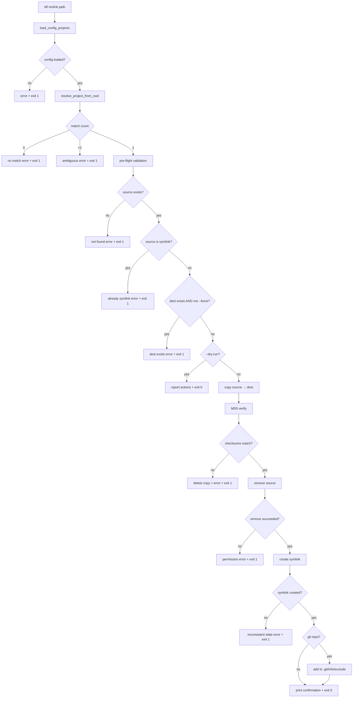

# Design Document: `revlink` Command

## Overview

The `revlink` command is the inverse of `link sync`. Where `link sync` pushes symlinks from a managed project into target directories, `revlink` works backwards: given a path that already exists in a target directory, it copies that path into the appropriate managed project, verifies the copy via MD5 checksum, replaces the original with a symlink, and optionally records the item in `.git/info/exclude`.

The command is invoked from within a target directory. It resolves the correct managed project automatically by matching the current working directory against the target paths declared in the config — no destination argument is required.

### Key Design Constraints

- `revlink` does **not** use `CmdOperation` / `ProjectProcessor`. Those abstractions iterate over all projects for a given operation; `revlink` takes a single path and works backwards from a known target directory to a single managed project. It has its own standalone execution path.
- The `--force` flag only overrides the pre-flight check that blocks when the destination already exists in the managed project. MD5 verification always runs regardless of `--force`.
- Dry-run mode performs all validation and reports what would happen, but never touches the filesystem.

---

## Architecture

`revlink` follows the same module layout as other commands but with a standalone execution path instead of the `ProjectProcessor` loop.

```
cli.py
  └── revlink command
        └── operations/revlink.py
              ├── RevlinkOperation        # orchestrates the full workflow
              ├── RevlinkFormatter        # formats step-by-step output
              └── ChecksumVerifier        # MD5 computation for files and trees

project_processor.py
  └── resolve_project_from_cwd()          # new function: CWD → ConfigProject

git_manager.py
  └── GitExcludeManager                   # existing, reused as-is
```

### Execution Flow

```
cli.py: revlink(path, dry_run, force)
  │
  ├─ load_config_projects()               # existing, reused
  ├─ resolve_project_from_cwd(projects, cwd)  # new
  │     └─ returns ConfigProject or error
  │
  └─ RevlinkOperation(source, dest_root, dry_run, force).run()
        ├─ Pre-flight validation
        ├─ ChecksumVerifier.compute(source)
        ├─ shutil.copy2 / shutil.copytree
        ├─ ChecksumVerifier.compute(dest)  → compare
        ├─ shutil.rmtree / Path.unlink (source)
        ├─ Path.symlink_to(dest)
        └─ GitExcludeManager.write_entries()  (if git repo)
```

### Mermaid Diagram



---

## Components and Interfaces

### `resolve_project_from_cwd` (new, in `project_processor.py`)

```python
def resolve_project_from_cwd(
    config_projects: dict[str, ConfigProject],
    cwd: Path,
) -> ConfigProject | None | list[ConfigProject]:
    ...
```

Iterates all `ConfigProject` instances and collects those whose `Mapping.targets` contain `cwd`. Returns:

- `ConfigProject` — exactly one match
- `None` — no match
- `list[ConfigProject]` — multiple matches (ambiguous)

The caller (`cli.py`) inspects the return type and emits the appropriate error message.

**Rationale for returning a union rather than raising:** The CLI layer owns the user-facing error messages (including suggestions). Keeping the resolver a pure function makes it straightforward to test with property-based tests.

### `RevlinkOperation` (new, in `operations/revlink.py`)

Orchestrates the full copy-verify-replace workflow for a single source path.

```python
@dataclass
class RevlinkOperation:
    source: Path          # absolute path to the item in the target directory
    dest_root: Path       # managed_project_path from the resolved ConfigProject
    dry_run: bool
    force: bool
    formatter: RevlinkFormatter
```

Public method: `run() -> int` — returns 0 on success, 1 on any error.

Internal steps (each returns early on failure):

1. `_validate()` — pre-flight checks
2. `_copy()` — `shutil.copy2` for files, `shutil.copytree` for directories
3. `_verify()` — `ChecksumVerifier` comparison
4. `_replace()` — remove source, create symlink
5. `_git_exclude()` — `GitExcludeManager` (only if git repo)

### `ChecksumVerifier` (new, in `operations/revlink.py`)

Computes a deterministic MD5 digest for a file or directory tree.

```python
class ChecksumVerifier:
    @staticmethod
    def compute(path: Path) -> str:
        """Compute MD5 digest for a file or directory tree.

        For a file: MD5 of file contents.
        For a directory: MD5 of the concatenated contents of all files,
        visited in sorted order by relative path (deterministic regardless
        of filesystem traversal order).

        Returns:
            Hex-encoded MD5 digest string.
        """
```

**Directory hashing algorithm:**

```python
import hashlib
from pathlib import Path

def _hash_directory(path: Path) -> str:
    md5 = hashlib.md5()
    for file in sorted(path.rglob("*")):
        if file.is_file():
            md5.update(str(file.relative_to(path)).encode())
            md5.update(file.read_bytes())
    return md5.hexdigest()
```

Sorting by `relative_to(path)` string ensures the same digest regardless of the order the OS returns directory entries.

### `RevlinkFormatter` (new, in `operations/revlink.py`)

Owns all `click.echo` calls for the command. Accepts a `dry_run: bool` flag and prefixes all output with `[dry-run]` when active.

```python
class RevlinkFormatter:
    def __init__(self, dry_run: bool) -> None: ...

    def computing_checksum(self, source: Path) -> None: ...
    def copying(self, source: Path, dest: Path) -> None: ...
    def checksum_ok(self) -> None: ...
    def symlink_created(self, link: Path, target: Path) -> None: ...
    def git_exclude_added(self, name: str) -> None: ...
    def git_exclude_exists(self, name: str) -> None: ...
    def force_warning(self, dest: Path) -> None: ...
    def error(self, message: str) -> None: ...
```

### CLI command (in `cli.py`)

```python
@cli.command()
@click.argument("path")
@click.option("--dry-run", is_flag=True, help="Preview actions without modifying the filesystem.")
@click.option("--force", is_flag=True, help="Overwrite existing destination in managed project.")
@click.pass_context
def revlink(ctx, path, dry_run, force):
    """Convert an existing file or directory into a managed symlink.

    Copies PATH to the managed project, verifies the copy via MD5 checksum,
    replaces the original with a symlink, and records the item in
    .git/info/exclude if the target directory is a Git repository.
    """
```

No new entries in `options.py` are needed — `--dry-run` and `--force` are boolean flags with no fixed string values.

---

## Data Models

No new persistent data models are introduced. `revlink` operates entirely on the filesystem and reuses existing config models.

### Relevant existing models

**`ConfigProject`** (`model/config.py`) — used by `resolve_project_from_cwd` to match target paths against CWD.

```python
@dataclass
class ConfigProject:
    managed_project_name: str
    managed_project_path: Path   # destination root for the copy
    mappings: list[Mapping]
```

**`Mapping`** (`model/config.py`) — each mapping's `targets` list is searched for a CWD match.

```python
@dataclass
class Mapping:
    targets: list[Path]
    subpaths: list[str] | None
    copy_paths: set[str] | None
```

### Transient operation state

`RevlinkOperation` holds transient state for a single invocation:

| Field | Type | Description |
|---|---|---|
| `source` | `Path` | Absolute path to the item in the target directory |
| `dest` | `Path` | `dest_root / source.name` — destination in managed project |
| `dry_run` | `bool` | Whether to skip filesystem mutations |
| `force` | `bool` | Whether to overwrite existing destination |
| `source_checksum` | `str` | MD5 of source, computed before copy |
| `dest_checksum` | `str` | MD5 of copy, computed after copy |

---

## Correctness Properties

*A property is a characteristic or behavior that should hold true across all valid executions of a system — essentially, a formal statement about what the system should do. Properties serve as the bridge between human-readable specifications and machine-verifiable correctness guarantees.*

### Property 1: Project resolver returns the unique matching project

*For any* set of `ConfigProject` instances and any `Path` that appears as a target in exactly one project's mappings, `resolve_project_from_cwd` SHALL return that project and only that project.

**Validates: Requirements 2.2, 2.3, 2.5**

### Property 2: Project resolver signals no-match correctly

*For any* set of `ConfigProject` instances and any `Path` that does not appear as a target in any project's mappings, `resolve_project_from_cwd` SHALL return `None`.

**Validates: Requirements 2.4**

### Property 3: Project resolver signals ambiguity correctly

*For any* set of `ConfigProject` instances where two or more projects share the same target path, `resolve_project_from_cwd` SHALL return a list containing all matching projects.

**Validates: Requirements 2.6**

> **Property reflection:** Properties 1, 2, and 3 together cover all branches of the resolver. They cannot be collapsed into one property because each branch has a distinct return type and distinct correctness condition. No redundancy.

### Property 4: Checksum verifier is deterministic for directory trees

*For any* directory tree, calling `ChecksumVerifier.compute` twice on the same tree SHALL produce identical hex digests.

**Validates: Requirements 4.6**

### Property 5: Checksum verifier produces matching digests for identical content

*For any* file or directory tree, copying it with `shutil.copy2` / `shutil.copytree` and then computing `ChecksumVerifier.compute` on both the original and the copy SHALL produce identical hex digests.

**Validates: Requirements 4.2, 4.6**

> **Property reflection:** Property 4 tests determinism (same input → same output on repeated calls). Property 5 tests correctness of the copy (original and copy produce the same digest). These are distinct properties — Property 4 does not imply Property 5 because a non-deterministic hasher could still produce matching digests for a copy. No redundancy.

### Property 6: Dry-run never modifies the filesystem

*For any* valid source path (file or directory) and any config, invoking `revlink` with `--dry-run` SHALL leave the filesystem in exactly the same state as before the invocation — no files created, moved, or deleted.

**Validates: Requirements 3.4, 6.4**

---

## Error Handling

All errors follow the same pattern: print a descriptive message via `click.echo` and return exit code 1. No exceptions propagate to the user.

| Condition | Message pattern | Exit code |
|---|---|---|
| Config not found / invalid | Delegated to `load_config_projects` (existing behavior) | 1 |
| No matching project for CWD | `"No managed project found for current directory: {cwd}\nHint: ..."` | 1 |
| Ambiguous project match | `"Ambiguous: multiple projects target {cwd}: {names}"` | 1 |
| Source path does not exist | `"Path does not exist: {source}"` | 1 |
| Source is already a symlink | `"Path is already a symlink: {source}"` | 1 |
| Destination exists, no `--force` | `"Destination already exists: {dest}\nUse --force to overwrite."` | 1 |
| MD5 mismatch after copy | `"Checksum mismatch — copy may be corrupt. Destination deleted."` | 1 |
| Permission error removing source | `"Permission denied removing {source}"` | 1 |
| Symlink creation failure | `"Failed to create symlink at {source} → {dest}. Filesystem may be in inconsistent state."` | 1 |

### Partial-failure safety

The most dangerous failure window is between removing the source and creating the symlink (Requirement 5.5). The design accepts this risk rather than introducing a temporary rename (which would add complexity and its own failure modes). The error message explicitly warns the user that the filesystem is in an inconsistent state so they can recover manually.

---

## Testing Strategy

### Unit tests (example-based)

- CLI wiring: `revlink` is registered, accepts `path`, `--dry-run`, `--force`
- Pre-flight validation: each error condition (non-existent path, symlink, dest exists without `--force`)
- `--force` overwrite: destination is replaced before copy
- MD5 mismatch recovery: failed copy is deleted, source is untouched
- Permission error on remove: correct error message, no further changes
- Symlink creation failure: inconsistent-state error message
- Git exclude: entry added when in git repo; skipped when not in git repo; idempotent when already present
- Output formatting: each `RevlinkFormatter` method produces the expected string, with and without `[dry-run]` prefix

### Property-based tests (Hypothesis)

The project already uses Hypothesis (`.hypothesis/` directory present). All property tests use Hypothesis with `@settings(max_examples=100)`.

Each test is tagged with a comment in the format:
`# Feature: revlink, Property {N}: {property_text}`

**Property 1–3: `resolve_project_from_cwd`**

Generate arbitrary lists of `ConfigProject` instances with random `Path` targets using `st.builds`. Verify the three resolver branches (unique match, no match, ambiguous) against the generated data.

**Property 4–5: `ChecksumVerifier`**

Use `tmp_path` fixtures with Hypothesis `st.binary()` and `st.lists(st.text())` to generate random file trees. Verify determinism (Property 4) and copy-identity (Property 5).

**Property 6: Dry-run filesystem invariant**

Generate random valid source paths in a `tmp_path` fixture. Snapshot the directory tree before and after invoking `RevlinkOperation` with `dry_run=True`. Assert the snapshots are identical.

### Integration tests

- End-to-end happy path: file in a temp git repo → `revlink` → symlink created, git exclude updated
- End-to-end with directory: directory tree → `revlink` → symlink created
- `--force` end-to-end: existing destination overwritten, symlink created
- Config resolution: `--config` flag, `~/.blfrc`, default `config.yml` all resolve correctly
