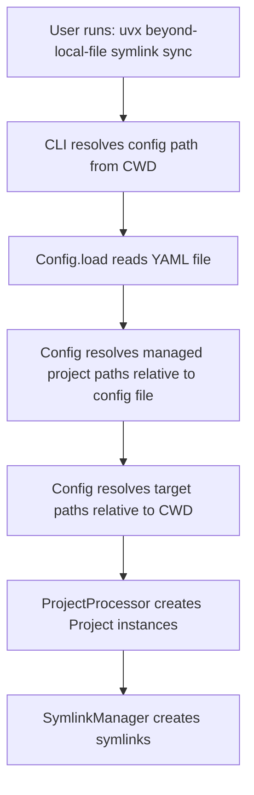

# Design Document: uvx-installable-tool

## Overview

This design transforms beyond-local-file from a mixed tool-and-data repository into a standalone, uvx-installable CLI tool. The transformation involves restructuring the codebase into a proper Python package with src-layout, configuring build system metadata, and implementing path resolution strategies that enable the tool to run from any directory while maintaining backward compatibility with existing configurations.

The key architectural shift is separating the tool (code) from managed projects (data). Currently, the tool lives in the same repository as the managed project directories (academy-broom, local-file, quvanai-server-old). After this transformation, users will install the tool via uvx and run it from their own managed projects directories, which can be maintained in separate repositories.

### Design Goals

1. Enable distribution as a standalone Python package installable via uvx
2. Maintain complete backward compatibility with existing config files and command syntax
3. Support execution from any directory without requiring navigation to tool installation location
4. Follow Python packaging best practices with src-layout structure
5. Provide clear migration path for existing users

### Key Challenges

1. **Path Resolution**: The tool must correctly resolve relative paths in config files regardless of where it's installed or executed from
2. **Import Structure**: Converting from root-level modules to package-relative imports
3. **Entry Point Configuration**: Properly exposing the CLI command through package metadata
4. **Build System**: Configuring hatchling to package only the tool code, excluding managed project directories

## Architecture

### Package Structure

The tool will adopt the standard Python src-layout, which provides clear separation between source code and other project files:

```
beyond-local-file/
├── src/
│   └── beyond_local_file/
│       ├── __init__.py
│       ├── cli.py
│       ├── config.py
│       ├── models.py
│       ├── formatters.py
│       ├── git_manager.py
│       ├── project_processor.py
│       └── symlink_manager.py
├── pyproject.toml
├── README.md
├── uv.lock
└── .python-version
```

The src-layout provides several benefits:
- Prevents accidental imports of uninstalled code during development
- Clear distinction between source code and project metadata
- Standard structure recognized by all Python build tools
- Ensures tests run against installed package, not source files

### Module Organization

All Python modules will be moved from the repository root into `src/beyond_local_file/`. The package structure will be:

- `__init__.py`: Package initialization, exports version information
- `cli.py`: Click-based CLI interface, entry point for the console script
- `config.py`: YAML configuration loading and path resolution
- `models.py`: Data models (Project, ProjectItem)
- `formatters.py`: Result formatting for CLI output
- `git_manager.py`: Git exclude file management
- `project_processor.py`: Project processing orchestration
- `symlink_manager.py`: Core symlink creation and checking logic

### Import Strategy

The tool will use relative imports within the package to maintain proper encapsulation:

```python
# In cli.py
from .project_processor import CheckOperation, ProjectProcessor, SyncOperation, load_config
from .symlink_manager import Action

# In project_processor.py
from .config import Config
from .formatters import CheckResultFormatter, SyncResultFormatter
from .models import Project
from .symlink_manager import Action, SymlinkManager

# In symlink_manager.py
from .git_manager import GitExcludeManager
from .models import Project
```

This approach ensures:
- Modules are properly namespaced within the package
- No dependency on sys.path manipulation
- Clear indication that imports are from the same package
- Compatibility with package installation and distribution

### Path Resolution Architecture

Path resolution is critical for the tool to work correctly when installed via uvx and executed from any directory. The strategy involves three types of paths:

1. **Config File Path**: Resolved relative to current working directory (CWD)
2. **Managed Project Paths**: Resolved relative to config file location
3. **Target Paths**: Resolved relative to current working directory

This design allows users to:
- Keep config files in their managed projects directory
- Use relative paths in config files that work regardless of tool installation location
- Run the tool from their managed projects directory without specifying absolute paths

#### Path Resolution Flow



### Build System Configuration

The tool uses hatchling as the build backend, configured in pyproject.toml:

```toml
[build-system]
requires = ["hatchling"]
build-backend = "hatchling.build"

[tool.hatch.build.targets.wheel]
packages = ["src/beyond_local_file"]
```

This configuration:
- Specifies hatchling as the PEP 517 build backend
- Tells hatchling to package the `src/beyond_local_file` directory
- Automatically excludes root-level files and managed project directories
- Produces a wheel that installs the package to site-packages

### Entry Point Configuration

The CLI command is exposed through the `[project.scripts]` section:

```toml
[project.scripts]
beyond-local-file = "beyond_local_file.cli:cli"
```

This creates a console script that:
- Is available in PATH after installation
- Points to the `cli` function in `beyond_local_file.cli` module
- Works with uvx for ephemeral execution
- Works with pip/uv for permanent installation

## Components and Interfaces

### CLI Module (cli.py)

The CLI module provides the user-facing command interface using Click.

**Public Interface**:
```python
@click.group()
def cli() -> None:
    """Main CLI entry point."""

@cli.group()
def symlink() -> None:
    """Symlink management commands."""

@symlink.command()
@click.argument("project_name", required=False)
@click.option("-c", "--config", default="config.yml")
def sync(project_name: str | None, config: str) -> None:
    """Synchronize symlinks from project to targets."""

@symlink.command()
@click.argument("project_name", required=False)
@click.option("-c", "--config", default="config.yml")
@click.option("--extra-exclude", is_flag=True)
def check(project_name: str | None, config: str, extra_exclude: bool) -> None:
    """Check symlink and exclude status."""

def ask_user_for_action(target_path: str) -> Action:
    """Prompt user for action on existing paths."""
```

**Responsibilities**:
- Parse command-line arguments and options
- Coordinate between config loading and operation execution
- Handle user interaction for conflict resolution
- Display operation results

**Dependencies**: project_processor, symlink_manager, click

### Config Module (config.py)

The Config module handles YAML configuration loading and path resolution.

**Public Interface**:
```python
class Config:
    def __init__(self, config_path: Path) -> None:
        """Initialize with config file path."""
    
    def load(self) -> dict[str, Any]:
        """Load YAML configuration."""
    
    def get_projects(self, project_name: str | None = None) -> dict[str, list[Path]]:
        """Get project configurations with resolved paths."""
```

**Path Resolution Logic**:
- Config file path: Resolved to absolute path on initialization
- Managed project paths: Resolved relative to config file directory
- Target paths: Resolved to absolute paths (relative to CWD if relative)

**Responsibilities**:
- Load and parse YAML configuration files
- Validate configuration structure
- Resolve all paths to absolute paths
- Filter projects by name if requested

**Dependencies**: pathlib, pyyaml

### Models Module (models.py)

The Models module defines data structures for projects and items.

**Public Interface**:
```python
@dataclass
class ProjectItem:
    name: str
    is_directory: bool
    source_path: Path
    
    def link_path(self, target_dir: Path) -> Path:
        """Get symlink path in target directory."""

@dataclass
class Project:
    name: str
    directory: Path
    items: list[ProjectItem]
    
    @classmethod
    def from_directory(cls, name: str, directory: Path) -> Project:
        """Create Project from directory scan."""
    
    def get_item_names(self) -> set[str]:
        """Get all item names."""
```

**Responsibilities**:
- Represent project structure
- Scan directories to discover items
- Provide item name collections for exclude file management

**Dependencies**: pathlib, dataclasses

### Formatters Module (formatters.py)

The Formatters module handles CLI output formatting.

**Public Interface**:
```python
class SyncResultFormatter:
    def __init__(self, project: Project, result: SyncResult) -> None:
        """Initialize with project and result."""
    
    def format(self, project_name: str, target_path: Path) -> None:
        """Format and output sync result."""

class CheckResultFormatter:
    def __init__(self, result: CheckResult, show_extra: bool = False) -> None:
        """Initialize with result."""
    
    def format(self, project_name: str, target_path: Path) -> None:
        """Format and output check result."""
```

**Responsibilities**:
- Format operation results for display
- Provide consistent output formatting
- Handle conditional display (e.g., extra exclude entries)

**Dependencies**: click, models, symlink_manager

### GitExcludeManager Module (git_manager.py)

The GitExcludeManager handles .git/info/exclude file operations.

**Public Interface**:
```python
class GitExcludeManager:
    def __init__(self, target_dir: Path) -> None:
        """Initialize for target directory."""
    
    def is_git_repo(self) -> bool:
        """Check if target is a git repository."""
    
    def read_entries(self) -> set[str]:
        """Read exclude file entries."""
    
    def write_entries(self, entries: set[str]) -> tuple[int, set[str]]:
        """Write entries, return (added_count, existing_entries)."""
    
    def remove_entries(self, entries: set[str]) -> set[str]:
        """Remove entries, return removed entries."""
```

**Responsibilities**:
- Detect git repositories
- Read and parse exclude files
- Add entries while preserving existing ones
- Remove entries when needed

**Dependencies**: pathlib

### ProjectProcessor Module (project_processor.py)

The ProjectProcessor orchestrates project operations.

**Public Interface**:
```python
def load_config(config: str, project_name: str | None = None) -> dict[str, list[Path]] | None:
    """Load configuration and return project data."""

class ProjectProcessor:
    def __init__(self, projects_data: dict[str, list[Path]]) -> None:
        """Initialize with project data."""
    
    def process_all(
        self, 
        operation: Callable[[Project, Path], bool],
        skip_invalid: bool = True
    ) -> bool:
        """Process all projects with operation."""

class SyncOperation:
    def __init__(self, ask_callback: Callable[[str], Action] | None = None) -> None:
        """Initialize sync operation."""
    
    def execute(self, project: Project, target_path: Path) -> bool:
        """Execute sync operation."""

class CheckOperation:
    def __init__(self, show_extra: bool = False) -> None:
        """Initialize check operation."""
    
    def execute(self, project: Project, target_path: Path) -> bool:
        """Execute check operation."""
```

**Responsibilities**:
- Load and validate configuration
- Iterate over projects and targets
- Execute operations on each project-target pair
- Handle errors and invalid configurations

**Dependencies**: config, models, symlink_manager, formatters, click

### SymlinkManager Module (symlink_manager.py)

The SymlinkManager handles core symlink operations.

**Public Interface**:
```python
class Action(Enum):
    SKIP = 1
    OVERWRITE = 2
    ABORT = 3

@dataclass
class SyncResult:
    created: set[str]
    already_correct: set[str]
    skipped: set[str]
    failed: set[str]
    git_added: int
    git_existing: set[str]
    aborted: bool

@dataclass
class CheckResult:
    symlink_exists: list[str]
    symlink_missing: list[str]
    exclude_present: set[str]
    exclude_missing: set[str]
    exclude_extra: set[str]

class SymlinkManager:
    def __init__(self, project: Project, target_path: Path) -> None:
        """Initialize for project and target."""
    
    def sync(self, ask_callback: Callable[[str], Action] | None = None) -> SyncResult:
        """Synchronize symlinks."""
    
    def check(self) -> CheckResult:
        """Check symlink and exclude status."""
```

**Responsibilities**:
- Create and validate symlinks
- Handle existing paths (skip, overwrite, abort)
- Coordinate with GitExcludeManager
- Return detailed operation results

**Dependencies**: git_manager, models, pathlib, shutil

## Data Models

### Configuration File Format

The tool uses YAML configuration files with the following structure:

```yaml
# Project name (directory name in managed projects)
project-name:
  - /absolute/path/to/target1
  - /relative/path/to/target2

another-project: /single/target/path
```

**Schema**:
- Top-level keys: Project names (string)
- Values: Single target path (string) or list of target paths (list[string])
- Paths: Can be absolute or relative

**Path Resolution Rules**:
- Relative project names: Resolved relative to config file directory
- Relative target paths: Resolved relative to current working directory
- Absolute paths: Used as-is

### Project Data Model

```python
@dataclass
class ProjectItem:
    """Represents a file or directory in a project."""
    name: str                # Item name (filename or directory name)
    is_directory: bool       # True if directory, False if file
    source_path: Path        # Absolute path to source item
```

```python
@dataclass
class Project:
    """Represents a managed project."""
    name: str                # Project name
    directory: Path          # Absolute path to project directory
    items: list[ProjectItem] # Items in the project
```

### Operation Results

```python
@dataclass
class SyncResult:
    """Result of sync operation."""
    created: set[str]         # Newly created symlinks
    already_correct: set[str] # Existing correct symlinks
    skipped: set[str]         # Skipped due to user choice
    failed: set[str]          # Failed to create
    git_added: int            # Number of exclude entries added
    git_existing: set[str]    # Already existing exclude entries
    aborted: bool             # True if user aborted
```

```python
@dataclass
class CheckResult:
    """Result of check operation."""
    symlink_exists: list[str]    # Existing symlinks
    symlink_missing: list[str]   # Missing symlinks
    exclude_present: set[str]    # Correct exclude entries
    exclude_missing: set[str]    # Missing exclude entries
    exclude_extra: set[str]      # Extra exclude entries
```


## Correctness Properties

A property is a characteristic or behavior that should hold true across all valid executions of a system—essentially, a formal statement about what the system should do. Properties serve as the bridge between human-readable specifications and machine-verifiable correctness guarantees.

### Property Reflection

After analyzing the acceptance criteria, several properties were identified as redundant or overlapping:

- Requirements 3.2 and 4.3 both test relative config path resolution (consolidated into Property 1)
- Requirements 3.3 and 5.1 both test relative project path resolution (consolidated into Property 2)
- Requirements 5.2, 5.4, and 4.4 all test that absolute paths are preserved (consolidated into Property 3)
- Requirements 1.2, 9.7, and 12.6 all test package exclusions (consolidated into example tests)
- Requirements 1.6, 1.7, 9.1, and 9.6 all test file organization (consolidated into example tests)
- Requirements 2.1, 9.4, and 12.4 all test entry point configuration (consolidated into example tests)

The remaining properties provide unique validation value and comprehensive coverage of the tool's behavior.

### Property 1: Config File Path Resolution

For any relative config file path and any current working directory, when the tool loads the config file, the resolved path should be relative to the current working directory.

**Validates: Requirements 3.2, 4.3**

### Property 2: Project Path Resolution

For any relative project path in a config file, when the tool resolves the project directory, the resolved path should be relative to the config file's directory location.

**Validates: Requirements 3.3, 5.1**

### Property 3: Absolute Path Preservation

For any absolute path (config file, project directory, or target location), when the tool resolves the path, the resolved path should be identical to the input path.

**Validates: Requirements 4.4, 5.2, 5.4**

### Property 4: Target Path Resolution

For any relative target path in a config file, when the tool resolves the target location, the resolved path should be relative to the current working directory.

**Validates: Requirements 5.3**

### Property 5: Working Directory Independence

For any valid config file and any current working directory, when the tool is executed with the config file path, the tool should successfully load the configuration and resolve paths correctly without depending on the tool's installation directory.

**Validates: Requirements 3.1, 3.4**

### Example Tests

The following requirements are best validated through specific example tests rather than property-based tests:

**Package Structure Examples**:
- Verify built wheel contains only src/beyond_local_file/ package (Requirements 1.1, 1.2, 1.3)
- Verify all modules exist in src/beyond_local_file/ (Requirements 1.7, 9.6)
- Verify __init__.py exists in package (Requirement 9.2)
- Verify root-level modules excluded from package (Requirements 9.7, 12.6)

**Metadata Examples**:
- Verify package name is "beyond-local-file" (Requirement 1.4)
- Verify Python version requirement is ">=3.13" (Requirement 1.5)
- Verify pyyaml>=6.0 dependency (Requirement 6.1)
- Verify click>=8.0 dependency (Requirement 6.2)
- Verify hatchling build backend (Requirement 12.1)
- Verify entry point configuration (Requirements 2.1, 2.2, 12.4)

**CLI Examples**:
- Verify "uvx beyond-local-file --help" displays help (Requirements 2.3, 8.1)
- Verify "symlink sync" and "symlink check" commands exist (Requirements 2.4, 7.2)
- Verify --config option accepted (Requirements 2.5, 7.3)
- Verify default config is "config.yml" in CWD (Requirements 2.6, 4.1)
- Verify error message when config not found (Requirement 4.2)

**Installation Examples**:
- Verify installation from git URL (Requirement 8.2)
- Verify editable installation with "uv pip install -e ." (Requirement 11.1)
- Verify dependencies installed automatically (Requirement 6.3)

**Backward Compatibility Examples**:
- Verify existing config files work (Requirement 7.1)
- Verify same output format (Requirement 7.4)
- Verify same symlink behavior (Requirement 7.5)

**Development Workflow Examples**:
- Verify "uv run ruff check" works (Requirement 11.3)
- Verify "uv run ruff format" works (Requirement 11.4)
- Verify dev dependencies in separate group (Requirement 11.5)

**Documentation Examples**:
- Verify README contains uvx installation instructions (Requirement 10.1)
- Verify README documents command syntax (Requirement 10.2)
- Verify README includes usage examples (Requirement 10.3)
- Verify README explains tool/data separation (Requirement 10.4)
- Verify README includes migration guide (Requirement 10.5)

## Error Handling

### Configuration Errors

**Missing Config File**:
- Error: Config file not found at specified path
- Handling: Display clear error message with the path that was searched
- Exit: Non-zero exit code

**Invalid YAML Syntax**:
- Error: YAML parsing fails
- Handling: Display error message with YAML parsing details
- Exit: Non-zero exit code

**Invalid Config Structure**:
- Error: Config doesn't match expected format (not a dict, invalid values)
- Handling: Display error message explaining expected format
- Exit: Non-zero exit code

**Project Not Found in Config**:
- Error: User specified project name not in config
- Handling: Display error message listing available projects
- Exit: Non-zero exit code

### Path Errors

**Project Directory Not Found**:
- Error: Project directory specified in config doesn't exist
- Handling: Display warning, skip project, continue with others
- Exit: Zero exit code if other projects succeed

**Target Directory Not Found**:
- Error: Target directory specified in config doesn't exist
- Handling: Display warning, skip target, continue with others
- Exit: Zero exit code if other targets succeed

**Empty Project Directory**:
- Error: Project directory exists but contains no items
- Handling: Display informational message, skip project
- Exit: Zero exit code

### Symlink Operation Errors

**Permission Denied**:
- Error: Cannot create symlink due to permissions
- Handling: Mark symlink as failed, display error, continue with others
- Exit: Zero exit code (partial success possible)

**Existing Path Conflict**:
- Error: Path exists at symlink location
- Handling: Prompt user for action (skip, overwrite, abort)
- Exit: Zero exit code if skip/overwrite, non-zero if abort

**Symlink Creation Failed**:
- Error: OS-level symlink creation fails
- Handling: Mark symlink as failed, display error, continue with others
- Exit: Zero exit code (partial success possible)

### Git Exclude Errors

**Cannot Write Exclude File**:
- Error: Permission denied or I/O error writing .git/info/exclude
- Handling: Display warning, continue with symlink operations
- Exit: Zero exit code (symlinks may still succeed)

**Exclude File Corruption**:
- Error: Existing exclude file cannot be read
- Handling: Display warning, skip exclude file updates
- Exit: Zero exit code (symlinks may still succeed)

### Error Handling Principles

1. **Fail Fast for Configuration**: Invalid configuration should stop execution immediately
2. **Continue on Partial Failures**: Individual symlink failures shouldn't stop processing other items
3. **Clear Error Messages**: All errors should include context (paths, project names, etc.)
4. **Appropriate Exit Codes**: Zero for success/partial success, non-zero for complete failure
5. **User Control**: Interactive prompts for conflicts, with sensible defaults

## Testing Strategy

### Dual Testing Approach

The testing strategy employs both unit tests and property-based tests to ensure comprehensive coverage:

- **Unit tests**: Verify specific examples, edge cases, and error conditions
- **Property-based tests**: Verify universal properties across all inputs

Both approaches are complementary and necessary. Unit tests catch concrete bugs and validate specific scenarios, while property tests verify general correctness across a wide range of inputs.

### Property-Based Testing

Property-based testing will use the **Hypothesis** library for Python, which is the standard property testing framework in the Python ecosystem.

**Configuration**:
- Minimum 100 iterations per property test (configurable via `@settings(max_examples=100)`)
- Each property test must reference its design document property via comment
- Tag format: `# Feature: uvx-installable-tool, Property {number}: {property_text}`

**Property Test Implementation**:

Each correctness property will be implemented as a single property-based test:

1. **Property 1: Config File Path Resolution**
   - Generate: Random relative config paths, random CWD paths
   - Test: Config path resolved relative to CWD
   - Tag: `# Feature: uvx-installable-tool, Property 1: Config File Path Resolution`

2. **Property 2: Project Path Resolution**
   - Generate: Random relative project paths, random config file locations
   - Test: Project path resolved relative to config file directory
   - Tag: `# Feature: uvx-installable-tool, Property 2: Project Path Resolution`

3. **Property 3: Absolute Path Preservation**
   - Generate: Random absolute paths for configs, projects, targets
   - Test: Resolved path equals input path
   - Tag: `# Feature: uvx-installable-tool, Property 3: Absolute Path Preservation`

4. **Property 4: Target Path Resolution**
   - Generate: Random relative target paths, random CWD paths
   - Test: Target path resolved relative to CWD
   - Tag: `# Feature: uvx-installable-tool, Property 4: Target Path Resolution`

5. **Property 5: Working Directory Independence**
   - Generate: Random valid configs, random execution directories
   - Test: Tool loads config and resolves paths correctly from any directory
   - Tag: `# Feature: uvx-installable-tool, Property 5: Working Directory Independence`

### Unit Testing

Unit tests will focus on:

**Specific Examples**:
- Package structure validation (wheel contents)
- Metadata validation (pyproject.toml values)
- CLI command existence and options
- Default behavior (config.yml discovery)
- Backward compatibility with existing configs

**Edge Cases**:
- Empty project directories
- Missing config files
- Invalid YAML syntax
- Non-existent paths
- Permission errors

**Error Conditions**:
- Config file not found
- Project not in config
- Invalid config structure
- Symlink creation failures
- Git exclude write failures

**Integration Points**:
- Config loading and path resolution
- Project scanning and item discovery
- Symlink creation and validation
- Git exclude file management
- CLI command execution

### Test Organization

```
tests/
├── unit/
│   ├── test_config.py          # Config loading and path resolution
│   ├── test_models.py          # Project and ProjectItem
│   ├── test_git_manager.py     # Git exclude operations
│   ├── test_symlink_manager.py # Symlink operations
│   └── test_cli.py             # CLI commands and options
├── property/
│   ├── test_path_resolution.py # Properties 1-4
│   └── test_independence.py    # Property 5
├── integration/
│   ├── test_sync_workflow.py   # End-to-end sync
│   ├── test_check_workflow.py  # End-to-end check
│   └── test_installation.py    # Package installation
└── conftest.py                 # Shared fixtures
```

### Test Coverage Goals

- **Line Coverage**: Minimum 90% for all modules
- **Branch Coverage**: Minimum 85% for conditional logic
- **Property Coverage**: 100% of correctness properties implemented
- **Example Coverage**: 100% of example tests implemented

### Continuous Integration

Tests should run on:
- Multiple Python versions (3.13+)
- Multiple operating systems (Linux, macOS, Windows)
- Both installed and editable modes
- Both uvx and pip installation methods

