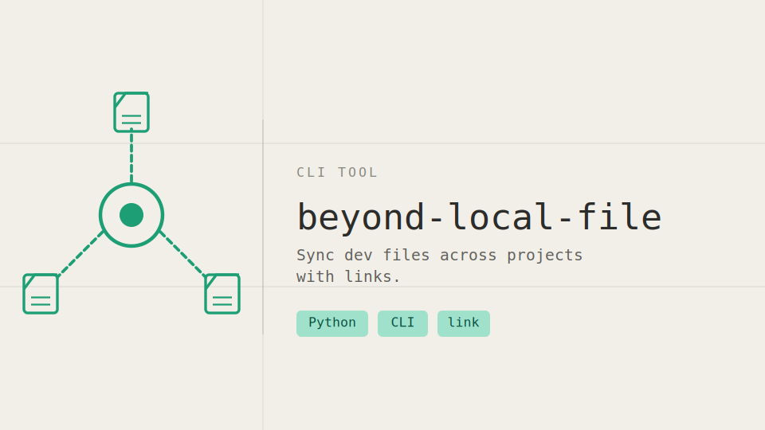

# Beyond Local File



Sync your local dev files across projects using symbolic links — without committing them to Git.

## Table of Contents

- [What is this?](#what-is-this)
- [Why not GNU Stow or chezmoi?](#why-not-gnu-stow-or-chezmoi)
- [Architecture: Tool and Data Separation](#architecture-tool-and-data-separation)
- [Installation](#installation)
- [Quick Start](#quick-start)
- [Configuration](#configuration)
- [Available Commands](#available-commands)
- [Documentation](#documentation)
- [Important Notes](#important-notes)
- [Platform Support](#platform-support)
- [Contributing](#contributing)
- [How the author uses it](#how-the-author-uses-it)
- [License](#license)

## What is this?

In real-world development, local files accumulate that are genuinely useful but shouldn't be
committed to Git: HTTP client files with private environment variables, AI agent hooks and
steering documents, task runner configs referencing local paths, debug logs, scratch specs.
You want them in your project directory — your editor, your AI tools, your task runner all
expect them there — but not in the repository.

`beyond-local-file` manages these files centrally and projects them into your target projects
via symbolic links (or physical copies where symlinks aren't supported). It also automatically
adds those links to each project's Git exclude list, so Git never sees them.

A few concrete things it handles that are hard to do with a shell script:

- Syncing an entire directory subtree (e.g., `.kiro/hooks/`) into multiple projects at once
- Copying specific files physically instead of symlinking, for tools that don't follow symlinks
- Detecting when a physical copy is out of sync with the source, with conflict detection
- Checking status across all managed projects at a glance (`blf link check`)

## 🎬 Quick Demo


*Watch beyond-local-file in action: install from GitHub, sync files, create symlinks, and manage Git excludes automatically.*

## Why not GNU Stow or chezmoi?

**GNU Stow** and **chezmoi** are excellent tools for dotfiles management — organizing your personal configuration files (`.bashrc`, `.vimrc`, `.gitconfig`) across machines.

- **Stow** uses a package-based approach with CLI parameters to create symlinks from a stow directory to `$HOME`.
- **chezmoi** is a comprehensive dotfiles manager with templating, encryption, password manager integration, and Git-based sync across machines.

**beyond-local-file** is designed for a different use case: per-project development files that shouldn't be committed to Git. Instead of managing `$HOME` dotfiles, it syncs local dev files (HTTP client configs, AI hooks, task runner configs) across multiple projects using a centralized `config.yml`. It handles Git excludes automatically and supports physical copies for tools that don't follow symlinks.

**Use Stow/chezmoi for:** Personal dotfiles in `$HOME`  
**Use beyond-local-file for:** Local dev files across multiple projects with different layouts

For a detailed comparison with use case examples, see [docs/alternatives-comparison.md](docs/alternatives-comparison.md).

## Architecture: Tool and Data Separation

`beyond-local-file` follows a clean separation between the **tool** (code) and **managed projects** (data):

- **The tool** is the CLI application itself — installed once via `uvx` or `uv tool install`, lives in
  Python's site-packages, contains no user data.
- **Managed projects** are your directories containing the local development files you want to share —
  live wherever you choose, can be version-controlled separately, independent of the tool.

```
# Tool (installed via uvx)
~/.local/share/uv/tools/beyond-local-file/   # managed by uv

# Managed Projects (your data, separate repository)
~/my-dev-files/
├── config.yml
├── project-a/
│   └── test.http
└── project-b/
    └── dev-config.yml

# Target Projects (where symlinks are created)
~/workspace/project-a/
└── test.http -> ~/my-dev-files/project-a/test.http
```

## Installation

### Recommended: `uv tool install` from PyPI

```bash
uv tool install beyond-local-file

# Update to latest version
uv tool install --upgrade beyond-local-file
```

### Alternative: `pipx` from PyPI

```bash
pipx install beyond-local-file

# Update
pipx upgrade beyond-local-file
```

### Ephemeral: `uvx` (no installation)

```bash
uvx beyond-local-file --help
```

### Install from GitHub (development version)

```bash
# Using uv
uv tool install git+https://github.com/xingyuli/beyond-local-file.git

# Using pipx
pipx install git+https://github.com/xingyuli/beyond-local-file.git
```

For development setup, see [docs/development.md](docs/development.md).

## Recommended: Create an Alias

The command name `beyond-local-file` is long. For convenience, create an alias:

```bash
# Add to your ~/.bashrc, ~/.zshrc, or equivalent
alias blf='beyond-local-file'
```

This documentation uses `blf` in all examples.

## Quick Start

1. Create a `config.yml` in your managed projects directory:

```yaml
project-a:
  - /Users/username/workspace/project-a
  - /Users/username/workspace/project-a-fork

project-b: /Users/username/workspace/project-b
```

2. Sync symlinks:

```bash
cd ~/my-dev-files
blf link sync
```

3. Check status:

```bash
blf link check
```

## Configuration

The `config.yml` file maps project names to target paths. Four formats are supported:

### 1. Simple string — single target

```yaml
project-a: /Users/username/workspace/project-a
```

### 2. Simple list — multiple targets

```yaml
project-b:
  - /Users/username/workspace/project-b
  - /Users/username/workspace/project-b-fork
```

### 3. Selective subpaths — sync specific items only

```yaml
project-c:
  target: /Users/username/workspace/project-c
  subpath:
    - .kiro/hooks
    - .vscode/settings.json
```

Only the listed subpaths are synced. Intermediate directories are created automatically.

### 4. Copy strategy — physical files for tool compatibility

Some tools don't recognize symlinks. Use `copy: true` for files that must be physical:

```yaml
project-d:
  target: /Users/username/workspace/project-d
  subpath:
    - .kiro/hooks                    # symlink (default)
    - path: .kiro/steering/rules.md  # physical copy
      copy: true
```

**Copy behavior:** Bidirectional sync with conflict detection. Changes in either location are detected and can be synced.

**Limitation:** Copy mode only supports single files, not directories. This is intentional — symlinks remain the primary workflow.

**Multiple targets:** The `target` key accepts a string or list in all formats.

For detailed examples, see [docs/configuration-reference.md](docs/configuration-reference.md).

### Config File Location

By default the tool looks for `config.yml` in the current directory. You can override this with `--config`, or create `~/.blfrc` to set a persistent default:

```yaml
# ~/.blfrc — point to your managed-files config
config_file: ~/my-dev-files/config.yml

# Or combine personal and company configs
config_file:
  - ~/personal/config.yml
  - ~/company/config.yml
```

See [Config File Resolution](docs/cli-reference.md#config-file-resolution-order) in the CLI reference for full details.

## Available Commands

| Command | Description |
|---------|-------------|
| `blf link sync [PROJECT]` | Create symlinks or copies in target directories |
| `blf link check [PROJECT]` | Check link status and Git excludes |

### Progress Tracking

When operations are interrupted (e.g., user chooses "Abort" during prompts), the tool displays progress information:

```
Operation aborted: 5/10 items processed
```

This helps you understand how much work was completed before the interruption.

For full option details and usage examples, see [docs/cli-reference.md](docs/cli-reference.md).

## Documentation

Comprehensive documentation is available in the [docs/](docs/) directory:

- **[Documentation Hub](docs/README.md)** - Complete documentation index
- **[Configuration Reference](docs/configuration-reference.md)** - Complete configuration documentation
- **[CLI Reference](docs/cli-reference.md)** - Complete command-line interface documentation
- **[Config Format Guide](docs/config-format-clarification.md)** - Understanding configuration
- **[Architecture Design](docs/architecture-design.md)** - Internal architecture
- **[Platform Support](docs/platform-support.md)** - Cross-platform compatibility
- **[Windows Support](docs/windows-support.md)** - Windows-specific guide
- **[Development Guide](docs/development.md)** - Contributing and development

## Important Notes

- Symbolic links use absolute paths to ensure correct targeting from different locations
- Only use in local development environments; do not commit symbolic links to Git
- If you move the source file location, re-run `sync`
- The tool is designed to run from your managed projects directory

## Platform Support

Tested and works on macOS and Linux. Windows support is implemented but not yet tested. See [docs/platform-support.md](docs/platform-support.md) for details.

Windows should work with Developer Mode (Windows 10/11) or Administrator privileges for symlink creation. See [docs/windows-support.md](docs/windows-support.md) for setup instructions. Feedback from Windows users is welcome.

## Contributing

Contributions are welcome! See [docs/development.md](docs/development.md) for development setup and guidelines.

## How the author uses it

I maintain two managed-project repos with `beyond-local-file` — one for personal GitHub
projects (`viclau-local-files`, a private repo), one for company work. They're completely
independent, each with its own `config.yml`, and the tool doesn't need to know about either.

The company-scoped repo's most involved config entry syncs an entire AI-assisted development
environment into a backend project: Kiro hooks for code review, requirement breakdown, and
weekly report generation; `.qoder` agent definitions, rules, and skills; `.vscode` settings;
a `Taskfile.yml` with build and deploy tasks; and a structured `local-file/` directory that
AI agents read and write into during development. Two of the Kiro steering documents are
synced with `copy: true` instead of as symlinks, because Kiro reads those files directly and
doesn't follow symbolic links — one config option, no manual copy workflow.

The personal repo has a single entry: `beyond-local-file` itself. The tool manages its own
development environment — a local task tracker, per-release archived changelogs, and an
agentic workspace for drafts and analysis — none of it committed to the main repo.

## License

MIT License — see the LICENSE file for details.
